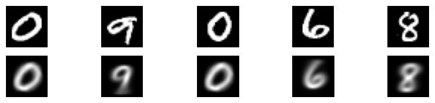
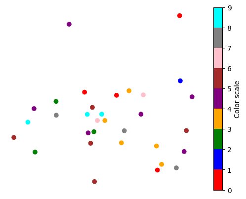
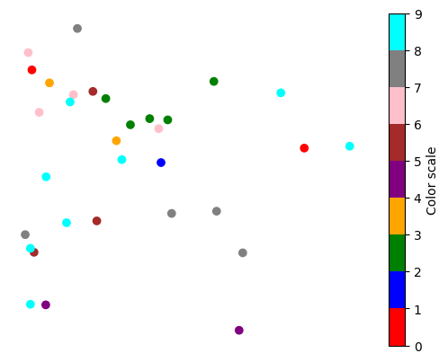

# cVAE simple from scratch
A simple Conditional Variational Autoencoder (cVAE) implemented from scratch for learning purposes.

Features:
  - Implemented from scratch in Pytorch.
  - Visualizes latent space evolution over training epochs.
  - Lightweight and easy to modify for educational purposes.

Laten space of first epoch:

Laten space of tenth epoch:

